## **Laporan Praktikum Workshop Administasi Jaringan**
# **Instalasi Mail Server**
### Dosen Pengampu : Dr. Ferry Astika Saputra ST, M.Sc

&nbsp;

## **Kelompok 6**
1. Troy Fredellius Ardystama (3121600038)
2. Nicholaus Adhyatma Surya Kusuma (3121600049)
3. Cantika Putri Romadhona (3121600051)

&nbsp;

### **Requirement**
---
1. **Mail server** adalah sebuah sistem yang membantu dalam pengaturan dan pengiriman email, baik dalam proses menerima atau mengirim. Dengan kata lain, mail server bertindak sebagai perantara dalam proses pengiriman dan penerimaan email. Email yang dikirim akan disimpan pada mail server, lalu kemudian diteruskan oleh mail server ke penerima yang dituju.
   
2. **Postfix** adalah mail transfer agent (MTA) yang bersifat free dan open source. Postfix merupakan MTA default untuk sejumlah sistem operasi yang bersifat unix. Postfix didistribusikan menggunakan Lisensi Umum IBM 1.0 yang merupakan lisensi perangkat lunak bebas namun tidak kompatibel dengan GPL. Postfix memiliki salah satu kelebihan yaitu mampu menahan "buffer overflow". Kelebihan lainnya adalah kesanggupan Postfix memproses surat elektronik dalam jumlah banyak.

3. **Dovecot** adalah sebuah server email open source yang mendukung protokol IMAP dan POP3, dirancang khusus untuk sistem Linux/UNIX dengan fokus pada keamanan. Dovecot merupakan pilihan yang sangat baik untuk instalasi baik yang kecil maupun besar. Program ini memiliki performa yang cepat, mudah dikonfigurasi, tidak memerlukan administrasi khusus, dan hanya membutuhkan sedikit penggunaan RAM/memori.

4. **Roundcube** adalah sebuah email client berbasis web yang menggunakan protokol IMAP. Salah satu fitur utama yang membedakan Roundcube adalah penggunaan teknologi Ajax. Roundcube merupakan perangkat lunak sumber terbuka yang menggunakan lisensi GNU General Public License (GPL).

&nbsp;

### **Konfigurasi Postfix dan Dovecot**
---
Sebelum meng-install mail server, ada baiknya kita menyiapkan domain khusus yang akan digunakan untuk mengonfigurasi mail server. Dalam percobaan ini, kita akan menggunakan nama domain mail.kampus-06.takehome.com yang dibuat menggunakan bind9 secara lokal.

1. **Update & Install**<br>
    Update repository dan install package postfix.
    ```
    apt update
    apt install postfix dovecot-imapd dovecot-pop3d
    ```

2. **Konfigurasi Postfix**<br>
    Setelah installasi selesai akan muncul message box, kemudian pilih internet site agar komunikasi email menggunakan protokol SMTP secara langsung.

    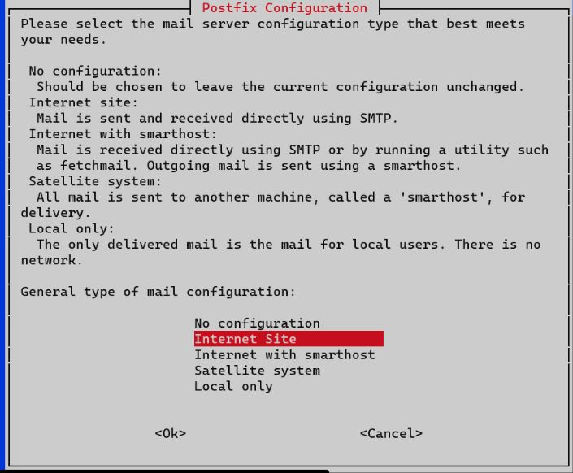<br>

    Selanjutnya masukkan nama domain yang akan digunakan.

    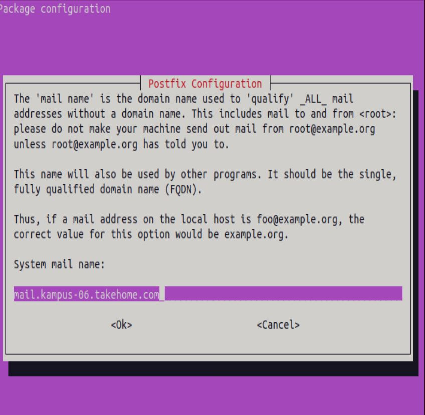<br>

    Setelah itu, postfix akan menyelesaikan installasinya. Setelah Installasi selesai, edit file di /etc/postfix/main.cf dan tambahkan home_mailbox = Maildir/ pada baris paling bawah.
    ```
    sudo nano /etc/postfix/main.cf
    ```

    ```
    inet_interfaces = all
    inet_protocols = all

    #tambahkan baris berikut pada baris paling bawah
    home_mailbox = Maildir/
    ```

    buat mail directory di directory /etc/skel
    ```
    maildirmake.dovecot /etc/skel/Maildir
    ```

    Setelah itu masukkan perintah berikut
    ```
    dpkg-reconfigure postfix
    ```

    Pilih beberapa pilihan dan isikan beberapa input yang akan muncul, sesuaikan dengan topology/konfigurasi sistem dan kebutuhan.
    
    <br>

    <br>

    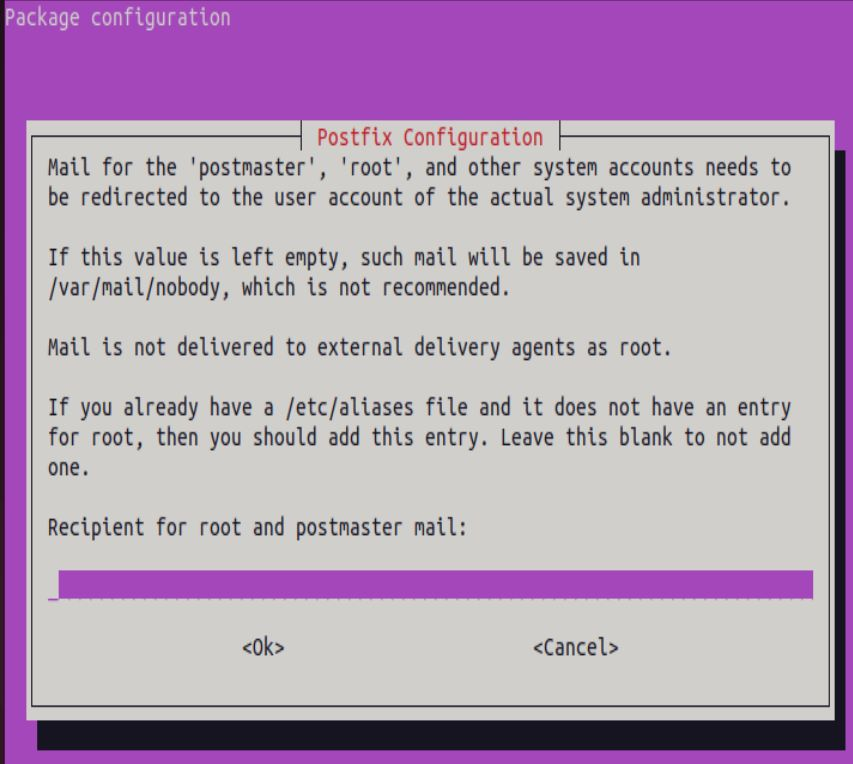<br>
    
    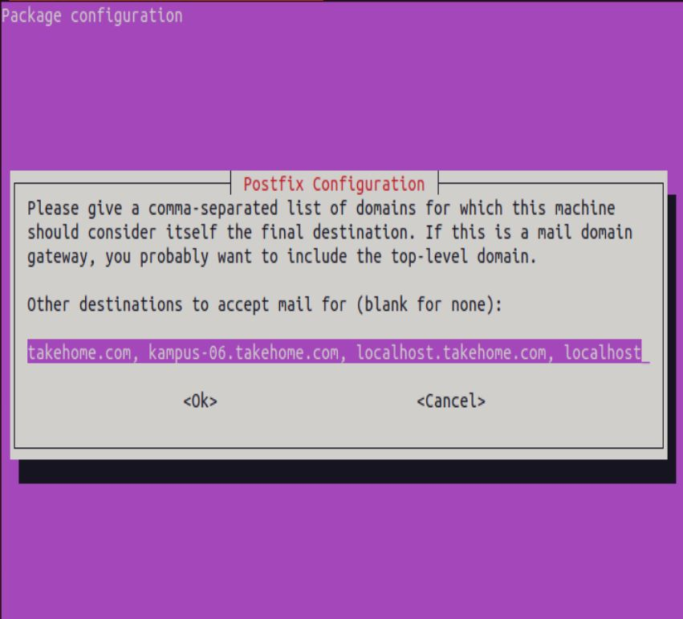<br>
    
    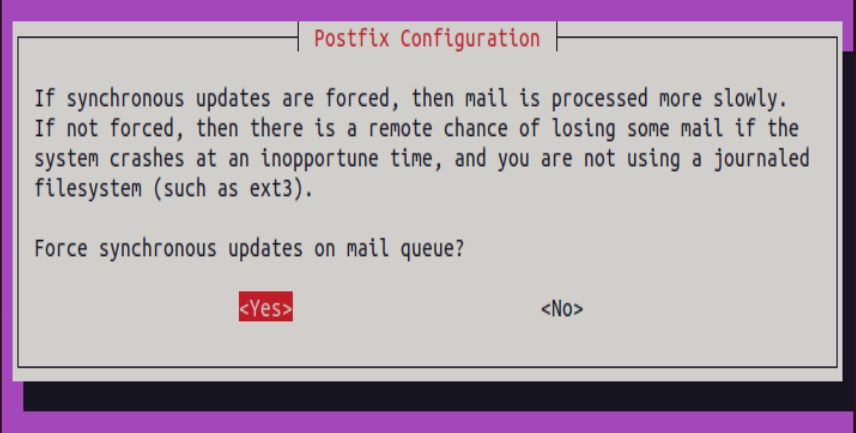<br>
    
    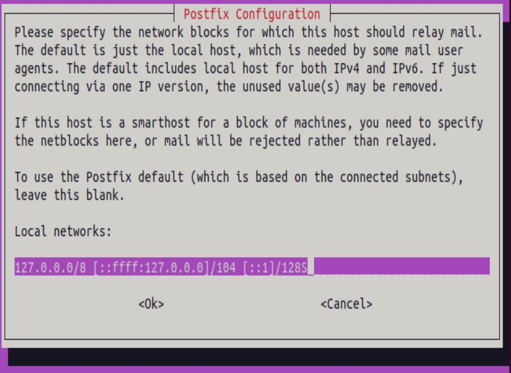<br>
    
    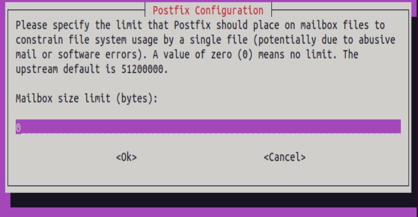<br>
    
    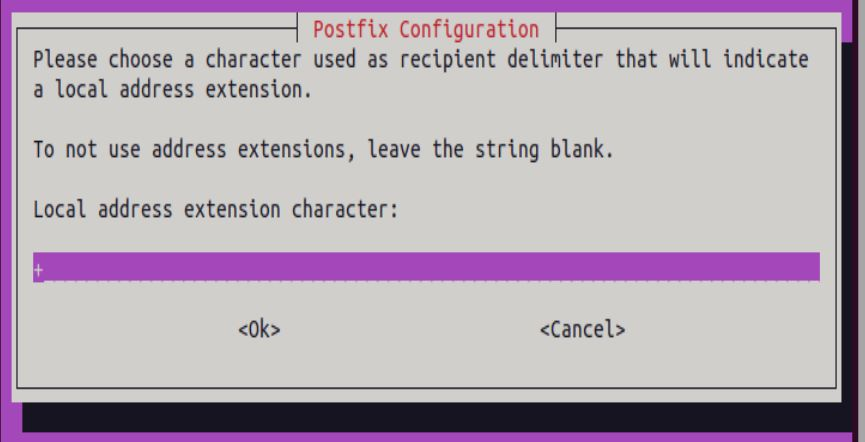<br>
    
    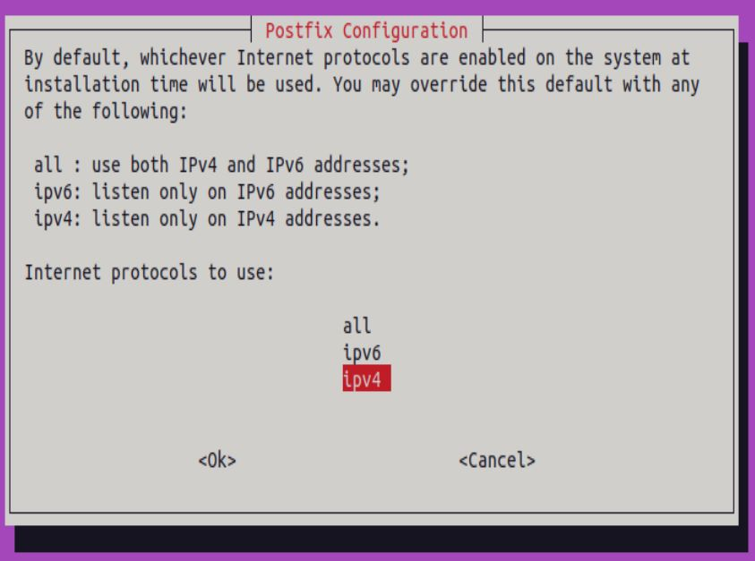<br>

    Restart postfix service.
    ```
    systemctl restart postfix
    ```

3. **Konfigurasi Dovecot**<br>
    Edit file konfigurasi /etc/dovecot/dovecot.conf.
    ```
    sudo nano /etc/dovecot/dovecot.conf
    ```

    Uncomment dan edit baris berikut.
    ```
    ...
    # If you want to specify non-default ports or anything more complex,
    # edit conf.d/master.conf.
    listen = *
    ...
    ```

    Edit file konfigurasi /etc/dovecot/conf.d/10-auth.conf.
    ```
    sudo nano /etc/dovecot/conf.d/10-auth.conf
    ```

    Uncomment dan ganti dari yes ke no.
    ```
    ...
    # connection is considered secure and plaintext authentication is allowed.
    # See also ssl=required setting.
    disable_plaintext_auth = no
    ...
    ```

    Edit file konfigurasi /etc/dovecot/conf.d/10-mail.conf.
    ```
    sudo nano /etc/dovecot/conf.d/10-mail.conf
    ```

    Uncomment pada baris berikut.
    ```
    ...
    mail_location = maildir:~/Maildir
    ...
    ```

    Beri comment pada baris berikut.
    ```
    ...
    # mail_location = mbox:~/mail:INBOX=/var/mail/%u
    ...
    ```

    Restart dovecot service.
    ```
    systemctl restart dovecot
    ```

&nbsp;

### **Konfigurasi RoundCube**
---
1. **Install Mariadb & Roundcube**<br>
    Install roundcube sebagai webmail yang akan digunakan oleh client, dan package mariadb yang nantinya akan digunakan sebagai database dari roundcube.
    ```
    apt install mariadb-server roundcube
    ```

    Pilih yes untuk membuat database secara otomatis oleh roundcube.
    
    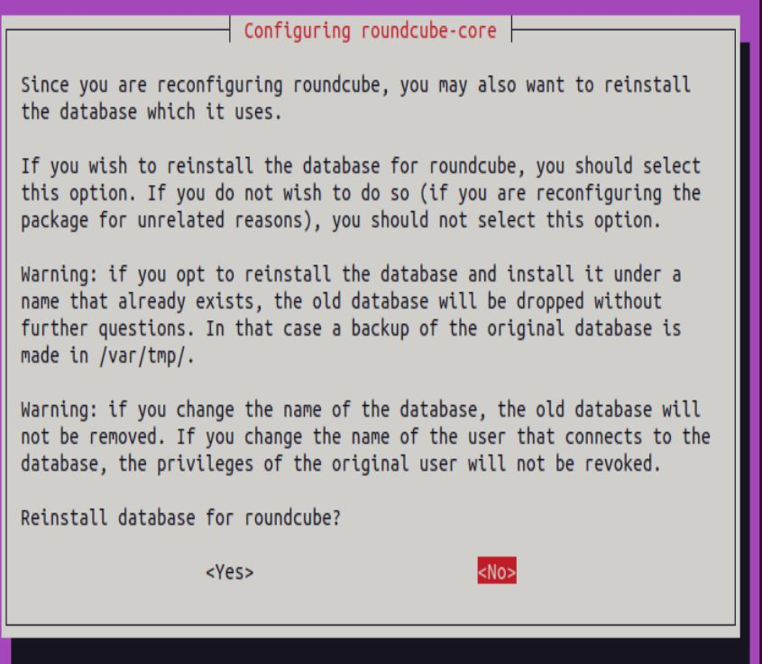<br>

    Masukkan password database roundcube.
    
    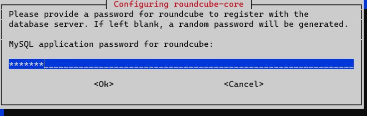<br>
    
    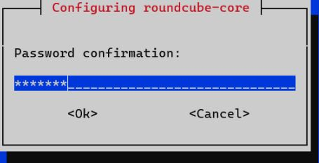<br>

    Edit file /etc/roundcube/config.inc.php.
    ```
    sudo nano /etc/roundcube/config.inc.php
    ```

    Isikan default host dengan nama domain mail server.
    ```
    ...
    // For example %n = mail.domain.tld, %t = domain.tld
    $config['smtp_server'] = 'mail.kampus-06.takehome.com';
    ...
    ```

    Ganti smtp server dengan nama domain mail server.
    ```
    ...
    // For example %n = mail.domain.tld, %t = domain.tld
    $config['smtp_server'] = 'mail.kampus-06.takehome.com';
    ...
    ```

    Ganti smtp port dari 587 ke 25.
    ```
    ...
    // SMTP port. Use 25 for cleartext, 465 for Implicit TLS, or 587 for STARTTLS (default)
    $config['smtp_port'] = 25;
    ...
    ```

    Kosongkan value dari smtp user.
    ```
    ...
    // will use the current username for login
    $config['smtp_user'] = '';
    ...
    ```

    Kosongkan value dari smtp password
    ```
    ....
    // will use the current user's password for login
    $config['smtp_pass'] = '';
    ...
    ```

    Configure ulang roundcube (langkah ini bisa dilewati).
    ```
    dpkg-reconfigure roundcube-core
    ```

    Kosongkan karena kita tidak menggunakan tls.
    
    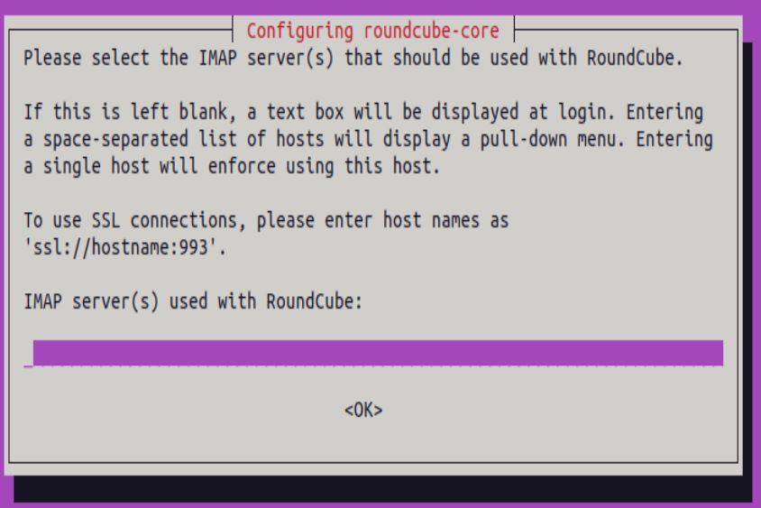<br>

    Pilih bahasa untuk roundcube.
    
    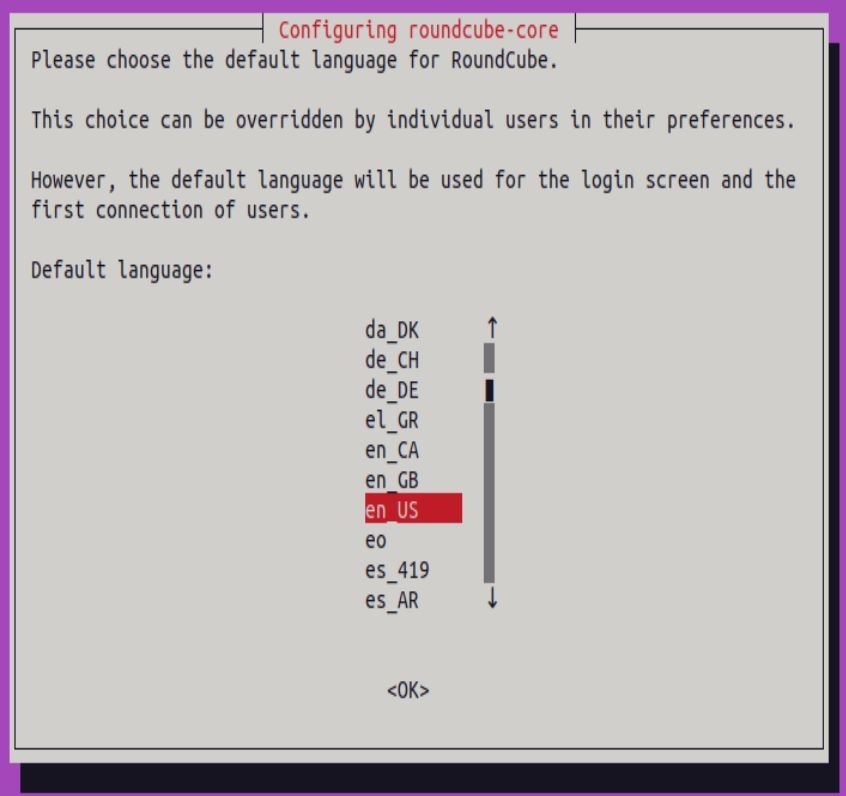<br>

    Pilih no jika tidak ingin reinstall database yang telah dibuat.
    
    <br>

    Check pada pilihan apache dan uncheck lighttpd.
    
    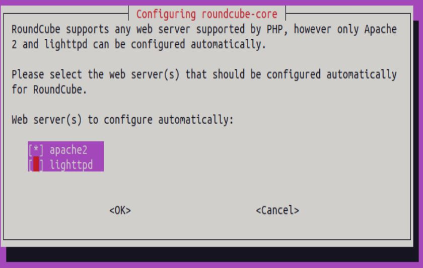<br>

    Pilih yes untuk merestart web server.
    
    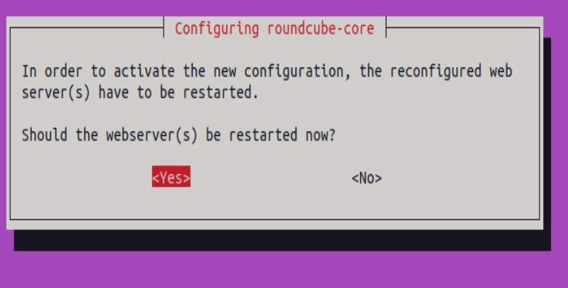<br>

    Keep local version jika tidak ingin merubah versi roundcube ke yang lebih terbaru.
    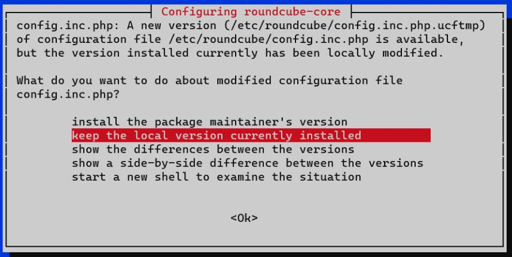<br>

    Edit apache config untuk memasukkan konfigurasi tambahan dari roundcube ke apache config.
    ```
    sudo nano /etc/apache2/apache2.conf
    ```

    Tambahkan pada baris paling bawah.
    ```
    Include /etc/roundcube/apache.conf
    ```

    Selanjutnya, masuk ke directory website apache dan tambahkan file baru untuk mail server.
    ```
    cd /etc/apache2/sites-available
    touch mail.conf
    vi mail.conf
    ```
    ```
    <VirtualHost *:80>
    ServerName mail.kampus-06.takehome.com
    DocumentRoot /usr/share/roundcube
    </VirtualHost>
    ```

    Disable apache default config dan enable kan mail config.
    ```
    a2dissite 000-default.conf
    a2ensite mail.conf
    ```

    Restart apache service.
    ```
    sudo systemctl restart apache2
    ```

&nbsp;

### **Testing**
---
- Buat user untuk mail terlebih dahulu
  ```
  adduser satu
  ```

  jangan lupa restart postfix dan dovecot
  ```
  systemctl restart postfix dovecot
  ```

- Selanjutnya buka web browser pada sisi client dan masukkan domain dari mail server **(mail.kampus-06.takehome.com)**, maka akan muncul interface dari roundcube. Lalu login menggunakan salah satu user yang telah dibuat (disini kita menggunakan user default).<br>
  Klik pada compose dan isikan pesan untuk user lainnya. Lalu klik send.
  
  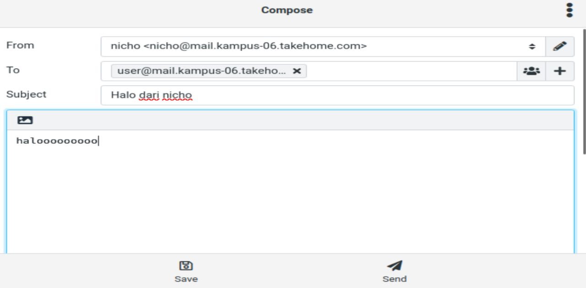<br>

  Logout dan login ke user penerima, maka akan muncul pesan yang dikirim.
  
  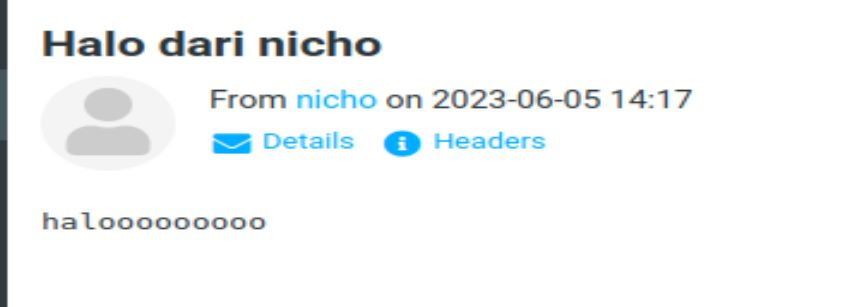<br>