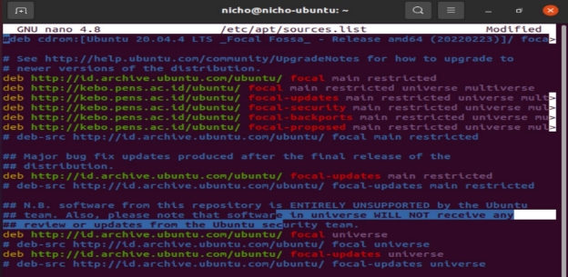
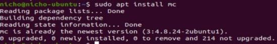
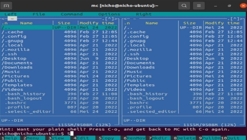

**LAPORAN RESMI          WORKSHOP ADMINISTRASI Package Manager**

Dosen Pengampu :

Dr. Ferry Astika Saputra ST, M.Sc

Nama : Nicholaus Adhyatma Surya Kusuma Kelas : 2 D4 IT B

NRP : 3121600049

**DEPARTEMEN TEKNIK INFORMATIKA DAN TEKNIK KOMPUTER**

**POLITEKNIK ELEKTRONIKA NEGERI SURABAYA**

**Evolusi  Sistem Operasi**

Sistem Operasi (Operating System) telah mengalami evolusi yang sangat signifikan sejak diciptakan pertama kali. Awalnya, sistem operasi hanya berfungsi untuk mengelola perangkat keras (hardware) seperti memori dan pemrosesan data, namun seiring dengan waktu dan berkembangnya teknologi, sistem operasi juga memainkan peran penting dalam mengelola software dan menyediakan antarmuka pengguna yang lebih interaktif.

Berikut adalah beberapa titik penting dalam evolusi sistem operasi:

Sistem Operasi Batch (1950-an-1960-an): Sistem operasi pertama yang diciptakan adalah sistem operasi batch. Sistem ini memungkinkan pengguna untuk mengumpulkan pekerjaan mereka dalam satu file, dan sistem operasi akan memproses file tersebut secara otomatis. Namun, sistem ini tidak interaktif dan tidak memiliki antarmuka pengguna.

Sistem Operasi Time-Sharing (1960-an-1970-an): Sistem operasi Time-Sharing memungkinkan beberapa pengguna untuk menggunakan sistem secara bersamaan. Sistem ini juga memperkenalkan antarmuka pengguna interaktif dan beberapa perintah yang lebih mudah digunakan.

Sistem Operasi Personal Computer (1980-an): Dengan munculnya komputer pribadi, sistem operasi seperti DOS (Disk Operating System) dan MacOS mulai populer. Sistem operasi ini memungkinkan pengguna untuk mengakses komputer secara pribadi dan mudah digunakan.

Sistem Operasi Jaringan (1990-an-2000-an): Sistem operasi jaringan, seperti Windows NT dan Unix, memungkinkan pengguna untuk terhubung dengan jaringan komputer dan berbagi sumber daya seperti printer dan file.

Sistem Operasi Mobile (2000-an-sekarang): Dengan munculnya ponsel pintar dan tablet, sistem operasi mobile seperti iOS dan Android menjadi populer. Sistem operasi ini dirancang untuk mendukung perangkat yang lebih kecil dan mudah digunakan dalam perangkat mobile.

Kesimpulannya, sistem operasi telah mengalami evolusi yang sangat signifikan selama beberapa dekade terakhir. Setiap perubahan ini membawa inovasi baru dan perubahan signifikan dalam cara pengguna berinteraksi dengan komputer.

**Ubuntu dan Debian**

Ubuntu dan Debian adalah dua jenis sistem operasi Linux yang sangat populer dan sering digunakan di lingkungan komputasi. Keduanya memiliki beberapa perbedaan dan kesamaan, meskipun keduanya berasal dari keluarga distribusi Linux yang sama.

Berikut adalah penjelasan singkat tentang Ubuntu dan Debian, serta beberapa sistem operasi Linux lainnya:

Ubuntu: Ubuntu adalah sistem operasi Linux berbasis Debian yang dikembangkan oleh Canonical Ltd. Ubuntu dirancang untuk mudah digunakan, aman, dan fleksibel. Ubuntu memiliki antarmuka desktop Unity yang intuitif dan mudah digunakan, dan menyediakan banyak perangkat lunak yang tersedia secara gratis melalui repositori bawaan Ubuntu. Ubuntu juga terkenal karena dukungan jangka panjang dan pembaruan keamanan.

Debian: Debian adalah sistem operasi Linux yang berfokus pada stabilitas dan keandalan. Debian adalah proyek yang bersifat komunitas dan tidak terkait dengan perusahaan tertentu. Debian menawarkan banyak pilihan lingkungan desktop dan aplikasi, dan menyediakan lebih dari 50.000 paket software yang tersedia melalui repositori Debian.

Fedora: Fedora adalah sistem operasi Linux yang dikembangkan oleh komunitas yang didukung oleh Red Hat. Fedora dirancang untuk digunakan oleh pengguna teknis dan menawarkan banyak fitur terbaru dan terkini di dunia open source.

CentOS: CentOS adalah sistem operasi Linux yang berbasis pada kode sumber Red Hat Enterprise Linux (RHEL). CentOS dikembangkan oleh komunitas dan fokus pada stabilitas dan keamanan.

OpenSUSE: OpenSUSE adalah sistem operasi Linux yang dikembangkan oleh SUSE Linux GmbH dan komunitas open source. OpenSUSE menawarkan banyak pilihan lingkungan desktop dan aplikasi, serta dukungan yang kuat untuk pengembangan dan virtualisasi.

Arch Linux: Arch Linux adalah sistem operasi Linux yang menargetkan pengguna yang lebih mahir teknis. Arch Linux menyediakan paket software yang terbaru dan terkini, serta fitur customisasi yang sangat fleksibel.

Setiap sistem operasi Linux memiliki kelebihan dan kekurangan masing-masing, tergantung pada kebutuhan dan preferensi pengguna. Penting untuk mempertimbangkan tujuan dan kebutuhan pengguna ketika memilih sistem operasi Linux yang tepat untuk digunakan.

**Sudo dan Su**

"su" dan "sudo" adalah dua perintah yang digunakan pada sistem operasi Unix dan Linux untuk mengakses hak akses root (superuser atau administrator) dalam menjalankan perintah yang memerlukan izin khusus.

"su" (singkatan dari "switch user") memungkinkan pengguna untuk beralih ke akun root (atau akun pengguna lain yang telah ditentukan) dengan memasukkan kata sandi root. Setelah masuk ke akun root, pengguna dapat menjalankan perintah dengan izin khusus yang tidak dapat dilakukan oleh pengguna biasa. Namun, pengguna harus sangat berhati-hati saat menggunakan perintah "su" karena pengguna akan memiliki akses penuh ke sistem dan dapat mengubah atau menghapus file sistem yang sangat penting.

"sudo" (singkatan dari "superuser do") adalah alternatif yang lebih aman daripada perintah "su". Ketika pengguna menggunakan "sudo" untuk menjalankan perintah, ia hanya memerlukan kata sandi pengguna untuk memverifikasi identitasnya. Kemudian, pengguna dapat menjalankan perintah dengan izin khusus, seperti memperbarui sistem, menginstal program, atau menghapus file sistem. Perintah "sudo" dapat dikonfigurasi oleh administrator sistem untuk membatasi akses pengguna atau grup pengguna tertentu ke perintah atau tindakan tertentu.

Kesimpulannya, "su" dan "sudo" adalah perintah yang digunakan pada sistem operasi Unix dan Linux untuk mengakses hak akses root atau superuser saat menjalankan perintah yang memerlukan izin khusus. Meskipun keduanya memiliki fungsi yang sama, penggunaan "sudo" lebih disarankan karena lebih aman dan memungkinkan administrator sistem untuk lebih mudah mengontrol akses pengguna ke sistem.

**Packet Maintenance linux ubuntu**

Package maintenance di Linux Ubuntu adalah proses pemeliharaan dan manajemen paket-paket perangkat lunak yang telah terinstal pada sistem operasi. Pada Linux Ubuntu, paket-paket perangkat lunak tersebut disimpan dalam repositori resmi Ubuntu.

Beberapa hal yang termasuk dalam package maintenance di Linux Ubuntu antara lain:

1. Memperbarui paket: Proses ini melibatkan pengunduhan dan instalasi pembaruan paket terbaru yang telah dirilis oleh pengembang perangkat lunak. Ini bertujuan untuk memastikan bahwa sistem operasi memiliki versi terbaru dari paket yang terinstal dan juga untuk memperbaiki bug dan keamanan yang teridentifikasi.
1. Memasang paket: Proses ini melibatkan penginstalan paket baru pada sistem operasi Ubuntu. Paket-paket tersebut bisa berupa aplikasi, driver, atau paket-paket lainnya yang dibutuhkan untuk menjalankan suatu program.
1. Menghapus paket: Proses ini melibatkan penghapusan paket yang tidak dibutuhkan atau sudah tidak diperlukan lagi dari sistem operasi Ubuntu. Ini membantu dalam menghemat ruang penyimpanan dan juga memastikan sistem operasi tetap bersih dan terorganisir.
4. Memperbaiki paket: Proses ini melibatkan perbaikan paket-paket yang rusak atau bermasalah pada sistem operasi Ubuntu. Ini bisa dilakukan dengan menggunakan utilitas pemeliharaan paket yang tersedia pada Ubuntu.

Package maintenance sangat penting untuk menjaga sistem operasi Ubuntu agar tetap aman dan stabil, serta memastikan bahwa paket-paket perangkat lunak yang terinstal berjalan dengan baik dan memenuhi persyaratan sistem. Ubuntu menyediakan berbagai alat manajemen paket yang mudah digunakan, seperti apt-get, aptitude, dan synaptic, yang memudahkan pengguna dalam melakukan tugas pemeliharaan paket pada sistem operasi Ubuntu.

**Setting Repository Ubuntu**

Untuk mengatur repository di Ubuntu, langkah-langkahnya adalah sebagai berikut:

1. Buka terminal pada Ubuntu dengan menekan tombol Ctrl + Alt + T.
1. Ketik perintah "sudo nano /etc/apt/sources.list" untuk membuka file sources.list dalam editor teks nano.
1. Pada file sources.list, Anda akan melihat daftar repository yang sudah terdaftar di Ubuntu. Setiap repository dinyatakan dengan baris yang dimulai dengan "deb" atau "deb-src".
1. Untuk menambahkan repository baru, salin dan tempelkan baris berikut di akhir file sources.list:
1. deb [sumber]://[nama server]/[direktori]/[versi] [distro] [main] Contoh: deb http://archive.ubuntu.com/ubuntu/ bionic main
1. Baris di atas menunjukkan repository utama Ubuntu yang tersedia pada versi Bionic Beaver.
1. Simpan dan keluar dari editor teks nano dengan menekan tombol Ctrl + X, kemudian tekan Y untuk menyimpan perubahan dan tekan Enter untuk keluar dari editor.
1. Kemudian, jalankan perintah "sudo apt-get update" untuk memperbarui daftar repository Ubuntu dengan repository baru yang telah ditambahkan.
1. Setelah itu, Anda dapat menggunakan perintah "sudo apt-get install" untuk menginstal paket atau program yang tersedia pada repository yang telah ditambahkan.

SS ubuntu :

**Multiverse di linux**

Multiverse adalah salah satu komponen pada repository (sumber daya penyimpanan) paket perangkat lunak pada sistem operasi Linux seperti Ubuntu dan Debian. Komponen ini menyediakan paket perangkat lunak yang tidak sepenuhnya bebas atau terbuka seperti pada komponen main atau universe.

Pada repository Linux, terdapat empat komponen utama yaitu:

- Main: Komponen utama yang menyediakan paket perangkat lunak bebas dan terbuka sepenuhnya yang didukung secara resmi oleh distribusi Linux.
- Universe: Komponen yang menyediakan paket perangkat lunak bebas dan terbuka sepenuhnya, tetapi tidak didukung secara resmi oleh distribusi Linux.
- Restricted: Komponen yang menyediakan paket perangkat lunak yang tidak sepenuhnya bebas karena lisensi yang dibatasi, seperti driver perangkat keras tertentu.
- Multiverse: Komponen yang menyediakan paket perangkat lunak yang tidak sepenuhnya bebas dan terbuka karena alasan non-lisensi, seperti plug-in media yang tidak didukung secara resmi.
- Paket perangkat lunak pada komponen Multiverse dapat digunakan dengan lisensi tertentu atau memiliki batasan penggunaan tertentu. Beberapa paket perangkat lunak pada komponen Multiverse misalnya seperti plug-in untuk media player dan codec untuk memutar file multimedia tertentu.

Pengguna Linux dapat mengakses dan menginstal paket perangkat lunak pada komponen Multiverse dengan mengaktifkan repositori Multiverse pada sistem operasi mereka. Namun, sebaiknya dipahami bahwa paket perangkat lunak pada komponen Multiverse tidak sepenuhnya bebas dan terbuka, sehingga perlu mempertimbangkan persyaratan penggunaan dan lisensi sebelum menggunakannya.

**APT linux**

Ubuntu menggunakan Advanced Package Tool (APT) sebagai package manager untuk mengelola instalasi, pembaruan, dan penghapusan paket pada sistem operasi Ubuntu. APT dapat digunakan melalui terminal atau menggunakan antarmuka grafis, seperti Ubuntu Software Center atau Synaptic Package Manager.

Berikut ini adalah beberapa perintah APT yang umum digunakan pada Ubuntu:

1. apt-get update: memperbarui daftar paket yang tersedia di repository Ubuntu.
1. apt-get upgrade: menginstal pembaruan untuk paket yang sudah terinstal.
1. apt-get install [nama\_paket]: menginstal paket baru.
1. apt-get remove [nama\_paket]: menghapus paket yang sudah terinstal.
1. apt-cache search [kata\_kunci]: mencari paket berdasarkan kata kunci tertentu.
1. apt-cache show [nama\_paket]: menampilkan informasi tentang paket tertentu.
1. apt-get autoremove: menghapus paket yang tidak diperlukan lagi.
1. apt-get clean: membersihkan cache paket yang sudah diunduh.
1. apt-get purge [nama\_paket]: menghapus paket dan file konfigurasinya.

APT memiliki kelebihan dalam mengelola dependensi paket, yang memungkinkan untuk memastikan bahwa semua dependensi yang diperlukan oleh suatu paket telah terinstal secara otomatis sebelum menginstal paket tersebut. Selain itu, APT juga mendukung beberapa sumber repository, yang memungkinkan pengguna untuk menginstal paket dari sumber yang berbeda. Hal ini memungkinkan pengguna untuk menginstal berbagai aplikasi dan paket pada Ubuntu dengan mudah dan efisien.

**Instalasi Package Linux**

- **mc**

MC (Midnight Commander) adalah sebuah aplikasi file manager untuk sistem operasi Linux yang tersedia sebagai package (pakage) pada repositori Ubuntu. Berikut ini adalah cara menginstal MC di Ubuntu menggunakan perintah Terminal.

1. Buka terminal di Linux Anda. Anda dapat membukanya dengan menekan tombol Ctrl + Alt + T pada keyboard.
2. Untuk menginstal MC, jalankan perintah berikut di terminal:

Perintah "sudo" digunakan untuk menjalankan perintah sebagai superuser atau administrator. Perintah "apt-get update" digunakan untuk memperbarui daftar paket perangkat lunak yang tersedia, sedangkan perintah "apt-get install mc" digunakan untuk menginstal paket Midnight Commander.

3. Tunggu hingga proses instalasi selesai. Terminal akan menampilkan pesan ketika instalasi selesai.
3. Setelah instalasi selesai, Anda dapat membuka Midnight Commander dengan mengetikkan "mc" di terminal atau dengan mencarinya di menu aplikasi desktop.
3. Untuk keluar dari MC, tekan tombol F10 atau pilih "Exit" dari menu MC.

Hasil SS :

- **net-tools**

Paket "net-tools" adalah paket yang berisi utilitas jaringan penting seperti ifconfig, route, netstat dan lain-lain. Untuk menginstal paket "net-tools" di Ubuntu dengan menggunakan APT (Advanced Package Tool), ikuti langkah-langkah berikut:

1. Buka terminal di Ubuntu. Anda dapat membukanya dengan menekan tombol Ctrl+Alt+T pada keyboard.
2. Jalankan perintah berikut untuk memperbarui daftar paket yang tersedia:

   Anda akan diminta untuk memasukkan password administrator.
3. Setelah perintah di atas selesai dieksekusi, jalankan perintah berikut di Terminal untuk menginstal paket "net-tools":

4. Tunggu beberapa saat hingga proses instalasi selesai. Setelah selesai, paket "net-tools" akan terinstal pada sistem Ubuntu Anda.
5. Untuk menggunakan utilitas yang terkandung dalam paket "net-tools", jalankan perintah seperti ifconfig, route, netstat dan sebagainya di terminal.

- **htop**
htop adalah sebuah utilitas yang digunakan untuk memonitor kinerja sistem pada sistem operasi Linux.
Untuk menginstal htop di Ubuntu, ikuti langkah-langkah berikut:

1. Buka terminal di Ubuntu. Anda dapat membukanya dengan menekan tombol Ctrl+Alt+T pada keyboard.
2. Jalankan perintah berikut untuk memperbarui daftar paket yang tersedia:

3. Setelah perintah di atas selesai dieksekusi, jalankan perintah berikut di Terminal untuk menginstal paket "htop":

4. Tunggu beberapa saat hingga proses instalasi selesai. Setelah selesai, htop akan terinstal pada sistem Ubuntu Anda.
5. Untuk menggunakan htop, jalankan perintah berikut di terminal:

maka akan tampil seperti gambar dibawah

Htop akan menampilkan antarmuka pengguna grafis yang dapat digunakan untuk memonitor kinerja sistem, melihat penggunaan CPU,memori, disk, dan lain-lain.

