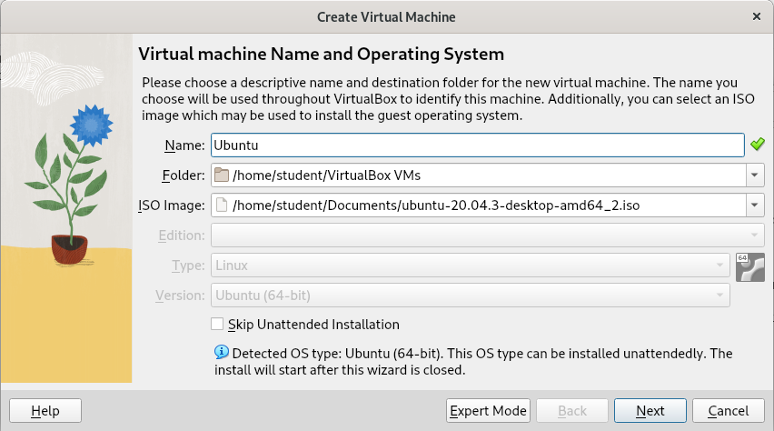
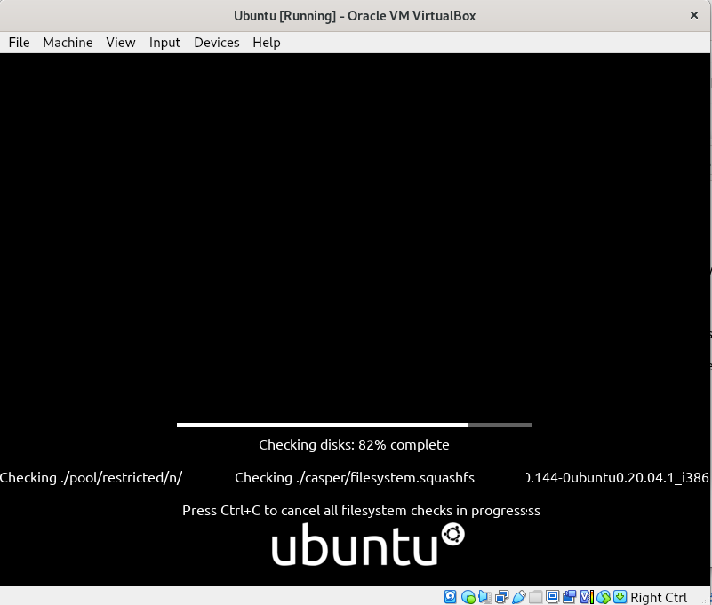

<div align="center">
  <h2>Laporan Praktikum Workshop Administrasi Jaringan<br/>Setting Winbox<h2/>
  
  
   
  <p align="center">
    Dosen Pengampu :
    <br />
    Dr. Ferry Astika Saputra ST, M.Sc
    <br/><br/>
    <p>
    Nama : Nicholaus Adhyatma Surya Kusuma <br/>
    Kelas : 2 D4 IT B <br/>
    NRP : 3121600049 <br/> 
    </p>
  </p>
</div>

### Install Wine

- Buka terminal dan perbarui sistem anda, jalankan :

```sh
sudo apt-get update
sudo apt-get upgrade
```

- Setelah proses pembaruan selesai, jalankan perintah berikut untuk menginstal Wine:

```sh
sudo apt-get install wine
```

- Jika Anda menggunakan sistem operasi Debian 64-bit, jalankan perintah berikut untuk menginstal dependensi 32-bit yang diperlukan untuk menjalankan aplikasi 32-bit di Wine:

```sh
sudo dpkg --add-architecture i386
sudo apt-get update
sudo apt-get install wine32
```

### Jalankan Winbox menggunakan wine

- Pastikan anda berada pada direktori yang sama dengan file winbo.exe

- Jalankan winbox menggunakan perintah berikut :

```sh
wine winbox64.exe
```

- kemudian winbox akan dijalankan seperti gambar dibawah :


### Routing pada winbox

Untuk mengonfigurasi routing pada Winbox, ikuti langkah-langkah berikut:

1. Buka aplikasi Winbox dan masuk ke router MikroTik Anda.

2. Pada panel kiri, klik menu IP dan pilih opsi Routes.

3. Klik tombol Add (+) untuk menambahkan routing baru.

4. Di jendela New Route, masukkan nilai berikut:

- Address: Masukkan subnet jaringan tujuan yang ingin Anda atur routingnya.
- Gateway: Masukkan alamat IP gateway untuk subnet tujuan.
- Klik tombol Apply , kemudian OK untuk menambahkan routing baru.


### Tes Ping

Jika sudah seleseai lakukan tes ping ke PC 1 lab

Ping ke PC 1


Ping ke PC 2


Ping ke PC 3


### Install VirtualBox

- Tambahkan repository VirtualBox ke dalam sources.list dengan perintah berikut:

```sh
echo "deb http://download.virtualbox.org/virtualbox/debian $(lsb_release -sc) contrib" | sudo tee /etc/apt/sources.list.d/virtualbox.list
```
Perintah di atas akan menambahkan repository VirtualBox ke dalam sources.list dan menyimpannya dalam file virtualbox.list di direktori /etc/apt/sources.list.d/.

- Tambahkan kunci GPG VirtualBox ke dalam sistem Debian Anda dengan perintah berikut:

```sh
wget -q https://www.virtualbox.org/download/oracle_vbox_2016.asc -O- | sudo apt-key add -

```

Perintah di atas akan mengunduh kunci GPG VirtualBox dan menambahkannya ke dalam sistem Debian Anda.

- Sekarang Anda dapat menginstal VirtualBox dengan perintah berikut:

```sh
sudo apt-get update
sudo apt-get install virtualbox-6.1


```

### Proses Instalasi Virtual Box





