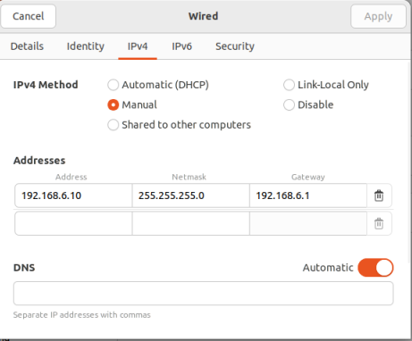

<div align="center">
  <h2>Laporan Praktikum Workshop Administrasi Jaringan<br/>Tugas kelompok dan hostname<h2/>
  
  
   
  <p align="center">
    Dosen Pengampu :
    <br />
    Dr. Ferry Astika Saputra ST, M.Sc
    <br/><br/>
    <p>
   <br/>
    Nama : Nicholaus Adhyatma Surya Kusuma <br/>
    Kelas : 2 D4 IT B <br/>
    NRP : 3121600049 <br/> 
    </p>
  </p>
</div>

### Setting IP

- Buka Konfigurasi Mikrotik menggunakan winbox -> IP -> Address

- Tambahkan 2 Interface sebagai berikut :

```sh
eth1 :
     - Address : 10.252.108.16.
     - Network : 10.252.108.0

eth2 :
    - Address : 192.168.2.1
    - Network : 192.168.2.0
```

<br/>
Screenshot<br/>
 

### Seting Default gateway 0.0.0.0/0 & IP route gateway 10.252.108.212

- Pilih menu IP -> Routes
- Tambahkan routingan baru dan konfigurasi default gatewaynya


### Setting DHCP Server via DHCP Setup menjadi 192.168.X.100 - 192.168.X.254
1. Pilih menu IP -> DHCP Server -> Klik DHCP Setup
2. Pada jendela DHCP Server Interface pilih ether2
3. Selanjutnya, ketika diminta menentukan IP Address yang akan digunakan sebagai default-gateway oleh DHCP Client masukkan IP 192.168.6.100 - 192.168.6.254


### Sambungkan PC atau laptop ke jaringan, cek IP address pastikan IP add dari PC mendapatkan IP add dari dhcp server


### Power up nyalakan VM, pastikan konfigurasi jaringan BRIDGE dan pastikan mendapatkan IP add dari dhcp server

- Konfigurasikan BRIDGE pada VM yang digunakan dengan cara klik Network configuration di VM => Ubah menjadi BRIDGE Adapter


### Konfigurasi IP VM Menjadi Static IP : 192.168.X.10



### Konfigurasi NTP ke 0. id.pool.ntp.org 1. id.pool.ntp.org
1. Set Up NTP CLient Mengubah Pengaturan jam Sistem

- Untuk melihat daftar zona waktu menjalankan perintah :
```sh
sudo timedatectl set-timezone Asia/Jakarta
```
- Mengatur RTC ke UTC, menjalankan perintah
```sh
sudo timedatectl set-local-rtc false
```
2. install NTP server
 Sebelum melakukan install maka perlu mengubah kembali IP jaringan yang sebelumnya static menjadi DHCP kembali.

 - Pertama update terlebih dahulu server dengan menggunakan perintah
 ```sh
 sudo apt update && sudo apt -y upgrade
 ```
- menginstall NTP Srver menggunakan perintah :
```sh
sudo apt -y install ntp
```

3. Konfigurasi NTP Server
- mengedit ntp.conf dengan menggunkan perintah :
```sh
sudo nano /etc/ntp.conf
```
-memberikan command pada :
```sh
#pool 0.ubuntu.pool.ntp.org iburst 
#pool 1.ubuntu.pool.ntp.org iburst 
#pool 2.ubuntu.pool.ntp.org iburst
#pool 3.ubuntu.pool.ntp.org iburst 
#pool 4.ubuntu.pool.ntp.org iburst 
#pool 5.ubuntu.pool.ntp.org iburst
```
- menambahkan baris
```sh
server 0.id.pool.ntp.org
server 1.id.pool.ntp.org
```

- restart ntp
```sh
sudo systemctl restart ntp
```

- Mengkonfirmasi apakah NTP service telah aktif menggunkan perintah :

```sh
systemctl status ntp
```


- cek keberhasilan konfigurasi dengan command :
```sh
ntpq -p
```


- Mengecek kembali settingan waktu dan tanggal menggunakan perintah 

```sh
timedatectl
```


### Konfigurasi Sudo


### Ganti hostname VM server10.kelompokX.takehome.com

- Sebelum menghubahnya, bisa dicek terlebih dahulu saat ini nama dari hostname sebelum diubah.image.png


- Untuk mengubahnya gunakan command dibawah

```sh
sudo hostnamectl set-hostname server10.kelompok6.takehome.com
```
- Setelah itu cek kembali hostnamenya

