<div align="center">
  <h2>Laporan Praktikum Workshop Administrasi Jaringan<br/>Instalasi dan konfigurasi DNS<h2/>
  
  
   
  <p align="center">
    Dosen Pengampu :
    <br />
    Dr. Ferry Astika Saputra ST, M.Sc
    <br/><br/>
    <p>
   <br/>
    Nama : Nicholaus Adhyatma Surya Kusuma <br/>
    Kelas : 2 D4 IT B <br/>
    NRP : 3121600049 <br/> 
    </p>
  </p>
</div>

---

## **Pendahuluan**

- DNS (Domain Name System)
DNS (Domain Name System) adalah sebuah sistem yang menghubungkan alamat IP (Internet Protocol) yang digunakan oleh komputer dengan nama domain yang mudah diingat oleh manusia. Setiap komputer yang terhubung ke internet memiliki alamat IP yang unik, namun alamat IP tersebut sulit diingat dan sulit untuk diketik oleh manusia. Oleh karena itu, DNS digunakan untuk memetakan nama domain yang mudah diingat menjadi alamat IP yang sesuai dengan komputer yang dimaksud.

- Bind9
BIND 9 (Berkeley Internet Name Domain) adalah salah satu perangkat lunak server DNS (Domain Name System) open-source yang paling populer dan banyak digunakan di seluruh dunia. BIND 9 dikembangkan oleh Internet Systems Consortium dan menyediakan layanan name resolution (pemetaan nama domain ke alamat IP) pada jaringan komputer.

---

## **Instalasi**

- Lakukan instalasi bind9 

```sh
sudo apt install bind9
```

 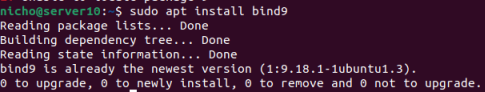

 ---

 ## **Overview**

-File konfigurasi DNS disimpan di direktori `/etc/bind`. File konfigurasi utama adalah `/etc/ bind/named.conf`, yang dalam tata letak yang disediakan oleh paket menyertakan berkas-berkas berikut:

- ```/etc/bind/named.conf.options``` : opsi DNS global
- ```/etc/bind/named.conf.local``` : untuk zona User
- ```/etc/bind/named.conf.default-zones``` : zona default seperti localhost.

---

 ## **Chacing name server**

 - Konfigurasi default bertindak sebagai *caching server*. Cukup hapus komentar dan edit bagian *forwarders* di ``` /etc/bind/named.conf.options ``` ganti dari 0.0.0.0 menjadi 8.8.8.8 untuk mengatur alamat IP server DNS ISP Anda.

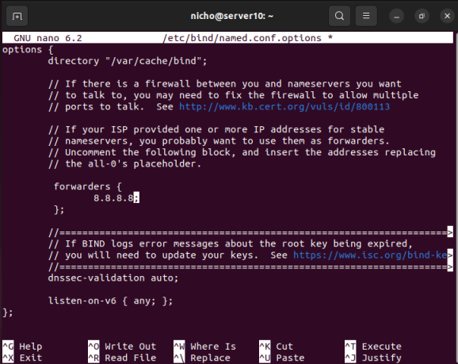

- untuk mengaktifkan konfigurasi diatas , mulai ulang server DNS , dengan perintah berikut :

```sh
sudo systemctl restart bind9.service
```
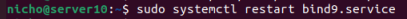

---

## **Forward Zone File (Domain ke IP)**

Untuk menambahkan zona DNS ke BIND9 dan mengubah BIND9 menjadi server Primer, edit bagian ```/etc/bind/named.conf.local```:

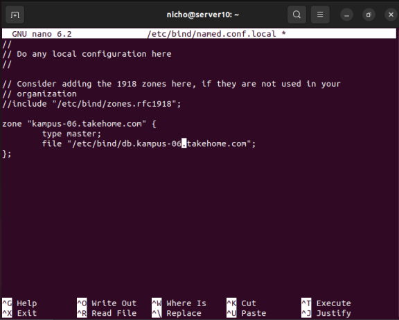

Sekarang gunakan zone file yang sudah ada sebagai template untuk membuat berkas ``/etc/bind/db.kampus-06.takehome.com`` dengan menggunakan perintah berikut:

- Forward Zone File (db.local)
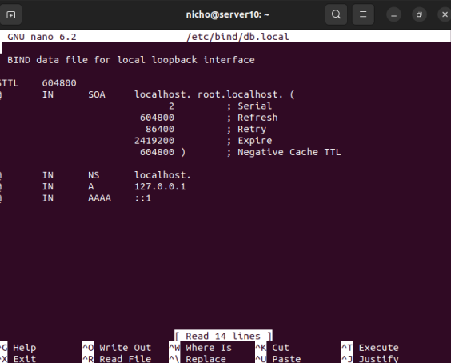

- Forward Zone File (db.kampus-06.takehome.com)
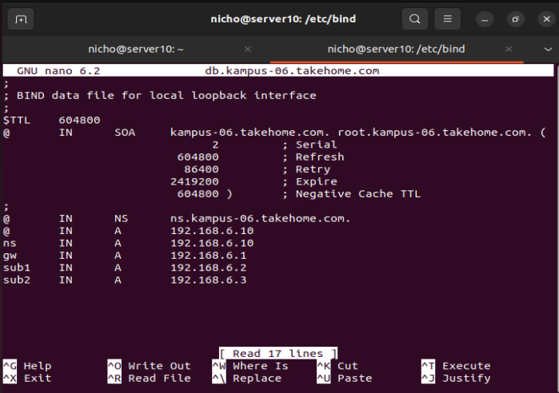

- Restart bind9 untuk menerapkan perubahan
```sh
sudo systemctl restart bind9.service
```
---

## **Reverse Zone File (IP ke Domain)**
Reverse zone file adalah jenis file zona DNS (Domain Name System) yang digunakan untuk memetakan alamat IP ke nama domain. Ini kebalikan dari file zona reguler, yang memetakan nama domain ke alamat IP.

Dalam file zona reverse, alamat IP terdaftar dalam urutan terbalik, dengan setiap oktet dari alamat dipisahkan oleh titik. Misalnya, jika alamat IP adalah 192.168.6.10, notasi urutan terbalik akan menjadi 10.6.168.192.

Zona Reverse perlu ditambahkan untuk memungkinkan DNS mengubah Alamat IP menjadi nama. Edit pada bagian /etc/bind/named.conf.local dan tambahkan syntax berikut:

```sh
zone ”1.168.192.in−addr.arpa”{
    type master;
    file”/etc/bind/db.192”;
};
```
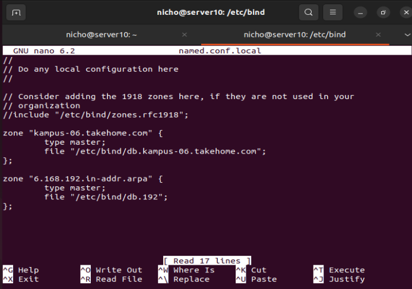

- kemudian buat file db.192 dari salinan db.127

```sh
sudo cp /etc/bind/db.127 /etc/bind/db.192
```
- edit file db.192 seperti dibawah

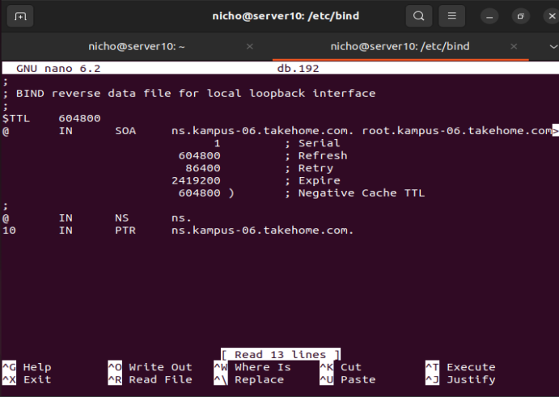

- setelah itu lakukan restart bind9

```sh
sudo systemctl restart bind9.server
```
---
 ## **Testing**

 Langkah pertama dalam menguji BIND9 adalah menambahkan Alamat IP nameserver ke host resolver. Nameserver utama harus dikonfigurasi seperti halnya host lain untuk memeriksa ulang berbagai hal. Buka DNS client untuk mengetahui detail tentang cara menambahkan alamat nameserver ke network client. Edit nameserver dan parameter untuk domain pada file ``/etc/resolv.conf``:

 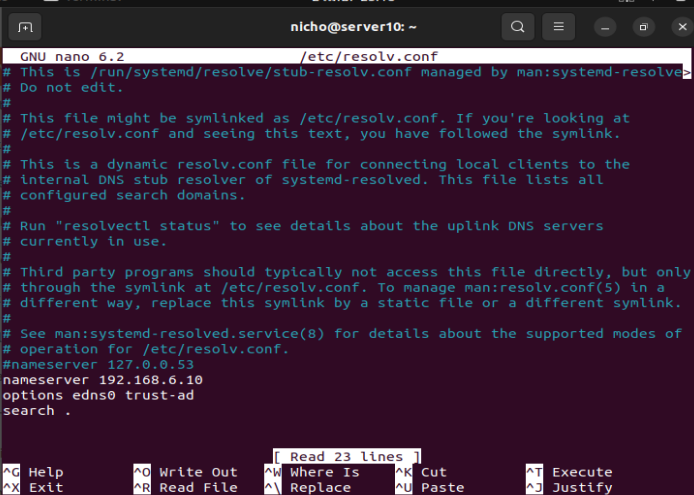

 Tes ping
 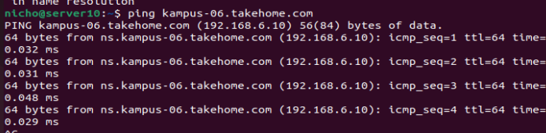

 nslookup
 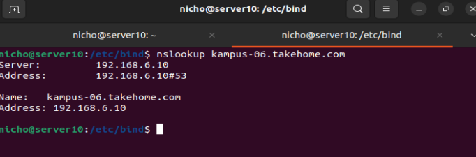


