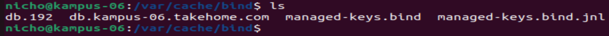
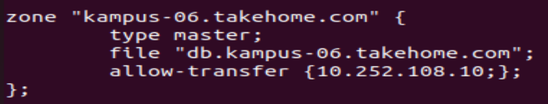
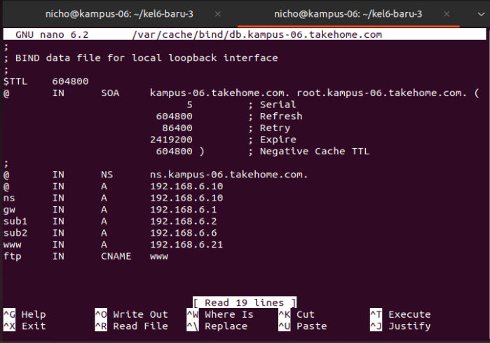
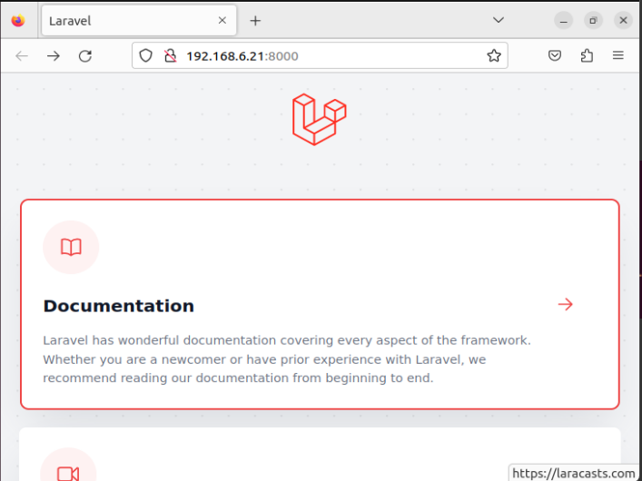

<div align="center">
  <h2>Laporan Praktikum Workshop Administrasi Jaringan<br/>Instalasi WebServer<h2/>
  
  
   
  <p align="center">
    Dosen Pengampu :
    <br />
    Dr. Ferry Astika Saputra ST, M.Sc
    <br/><br/>
    <p>
  <p>Disusun oleh :</p>
    - Troy Fredellius Ardystama 3121600038 <br/>
    - Nicholaus Adhyatma Surya Kusuma 3121600049 <br/> 
    - Cantika Putri Romadhona 3121600051 <br/>
    </p>
  </p>
</div>

### 1. Konfigurasi DNS

- Pindahkan file konfigurasi dns yang sebelumnya berada pada ``/etc/bind`` ke ``/var/cache/bind``



- kemudian  pada file ``named.conf.local`` pada direktori ``/etc/bind`` tambahakn ``allow transfer { ip address ;};`` seperti gambar di bawah :


- Penambahan ``allow-transfer {10.252.108.10;};`` pada konfigurasi zona tersebut digunakan untuk memberi izin transfer zona ke alamat IP ``10.252.108.10`` yang memungkinkan server DNS lain untuk menyalin catatan zona tersebut, fungsinya untuk melakukan sinkronisasi zona antara server DNS yang berbeda. Agar server DNS lain yang memiliki IP ``10.252.108.10`` dapat menyalin catatan di zona "kampus-06.takehome.com" dari server DNS BIND ini.

- tambahkan ip clint ke file db.kampus-06.takehome.com pada wwww seperti gambar dibawah :


### 2. Instalasi Laravel pada client web server
- Install composer dengan perintah 
```sh
curl -sS https://getcomposer.org/installer -o /tmp/composer-setup.php
```

- Install Laravel dengan perintah
```sh
composer create-project laravel/laravel example-app
```

- Jalankan laravel dengan perintah 
```sh
php artisn serve --host={ip_client} --port=8000
```
